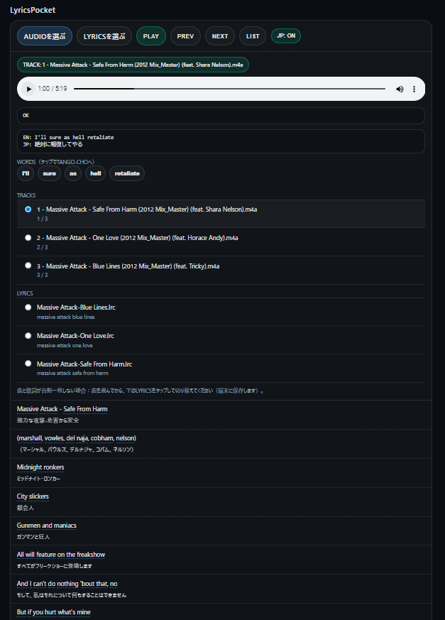

# LyricsPocket

ローカルにある音源（mp3 / m4a など）を再生しながら、歌詞（.lrc / .txt）を表示・同期し、必要なら日本語訳も併記できる **軽量PWA** です。  
さらに、歌詞中の英単語をタップして **TANGO-CHO** に渡し、単語帳/学習に回せます。

**Demo**: https://masato-nasu.github.io/LyricsPocket/

---

## できること / Features

- 🎵 **音源再生**（端末内の mp3 / m4a 等を選択して再生）
- 📝 **歌詞表示**
  - **LRC（タイムタグ付き）**: 再生位置に合わせて現在行をハイライト
  - **TXT（プレーンテキスト）**: 文章として表示（同期なし）
- 🇯🇵 **日本語訳（任意）**
  - `JP: ON` で **英文の直下に日本語訳を表示**
  - 翻訳はオンライン（MyMemory）を利用するため **ネット接続が必要** です  
  - 環境によって **CORS/回数制限** などで失敗する場合があります
- 📚 **TANGO-CHO連動**
  - 歌詞中の **英単語をタップ** → TANGO-CHOへ `word` + 例文（その歌詞行）を渡します  
  - 学習・クイズに直結（「歌詞→単語→単語帳」）

---

## 使い方 / How to use

1. **AUDIOを選ぶ**（端末内の音源ファイル）
2. **LYRICSを選ぶ**（`.lrc` もしくは `.txt`）
3. `PLAY` で再生  
   - LRCの場合：時間に応じて歌詞が自動で追従します
4. `JP: ON` で日本語訳の表示（ネット必須）
5. 英単語をタップして **TANGO-CHO** へ送る

### 曲と歌詞が一致しないとき
- 自動一致しない場合は、**曲を選んでから** 画面下の `LYRICS` 一覧で歌詞を切り替えてください（端末に保存されます）。

---

## iOS / Android の注意

- **iOS（Safari / PWA）では「フォルダ選択」ができません**  
  → AUDIO と LYRICS を **ファイル単位**で選択してください
- 端末・ブラウザの制約で、m4a の再生可否や挙動が変わることがあります（まずは Safari/Chrome の両方で確認推奨）

---

## 著作権・取り扱いについて（重要）

- このアプリは **音源や歌詞を配布しません**。  
  利用者が所有/許諾を得たファイルを、端末から選択して利用する前提です。
- 歌詞の取り扱いは各地域の法令・利用規約・権利者の条件に従ってください。

---

## 仕組み（概要）

- **完全静的**（HTML/CSS/JS のみ）
- 端末の **File Picker** で音源/歌詞を読み込み
- LRC はタイムタグを解析して同期表示
- 翻訳は MyMemory のオンラインAPI（環境により失敗する場合あり）
- TANGO-CHO へは URL パラメータで `word` と `ex`（例文）を渡します

---

## 免責
本アプリの利用により生じたいかなる損害についても、作者は責任を負いません。

---
